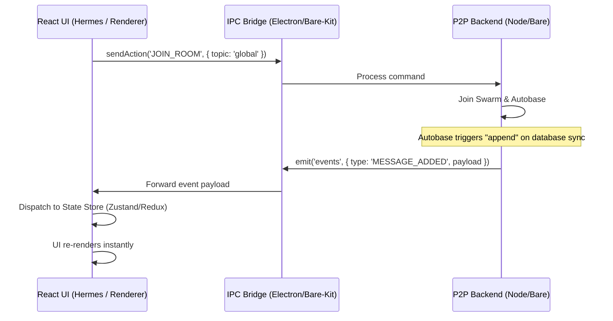

# P2P Architecture Guide: Electron & Expo with Hypercore

This document details the architectural decisions, structural patterns, and data-flow designs for building cross-platform peer-to-peer (P2P) applications using the Hypercore stack on both desktop (Electron) and mobile (Expo/React Native).

---

## 1. Runtime & Backend Architecture

To run a P2P stack (Hypercore, Hyperswarm, Autobase) on both desktop and mobile, we run a backend environment isolated from the main UI thread.

```
+------------------------------------------------------------------------+
|                               DESKTOP (Electron)                       |
|  +---------------------------+             +------------------------+  |
|  | Renderer Process (React)  | <---IPC---> | Main Process (Node.js) |  |
|  +---------------------------+             +------------------------+  |
+------------------------------------------------------------------------+

+------------------------------------------------------------------------+
|                                MOBILE (Expo)                           |
|  +---------------------------+             +------------------------+  |
|  | React Native UI (Hermes)  | <---IPC---> | Bare Worklet Thread    |  |
|  +---------------------------+             +------------------------+  |
+------------------------------------------------------------------------+
```

### Electron (Desktop)
* **UI**: Chromium Renderer process.
* **Backend**: Node.js Main process.
* **Threading**: The Main process handles native sockets (TCP/UDP via `utp-native`) and filesystem writes out of the box, completely independent of the UI thread.
* **Communication**: Standard Electron IPC (`ipcRenderer` and `ipcMain`).

### Expo / React Native (Mobile)
* **UI**: React Native thread running Hermes or JavaScriptCore.
* **Backend**: An isolated background thread called a **Bare Worklet** (provided by `react-native-bare-kit`).
* **Why the Worklet is required**: The mobile JS engines (Hermes) are optimized for UI rendering and cannot run the raw Node.js APIs or native compiled C++ modules (`sodium-native`, `utp-native`) needed for P2P networking and encryption. The Worklet embeds Holepunch's **Bare Runtime**, which compiles these native components for iOS/Android and runs them off the UI thread to prevent visual freezing.
* **Communication**: A duplex buffer-based **IPC Stream** exposed by the `Worklet` instance.

---

## 2. Binary Serialization: compact-encoding vs. hyperschema

P2P applications synchronize data directly over raw network sockets. Using JSON stringification (`JSON.stringify` / `JSON.parse`) is inefficient and prone to crashing when different peers run different versions of the app.

### Raw `compact-encoding` (Recommended)
You write manual binary serializers and deserializers using low-level compact-encoding primitives.

* **Pros**: Simple, zero build/code-generation steps, extremely fast, highly flexible.
* **Cons**: You must manually manage version flags inside your encoders if you add or modify fields later.

```javascript
// schema.js
import cenc from 'compact-encoding';

export const chatMessage = {
  preencode(state, msg) {
    cenc.string.preencode(state, msg.sender);
    cenc.string.preencode(state, msg.text);
    cenc.uint.preencode(state, msg.timestamp);
  },
  encode(state, msg) {
    cenc.string.encode(state, msg.sender);
    cenc.string.encode(state, msg.text);
    cenc.uint.encode(state, msg.timestamp);
  },
  decode(state) {
    return {
      sender: cenc.string.decode(state),
      text: cenc.string.decode(state),
      timestamp: cenc.uint.decode(state)
    };
  }
};
```

### `hyperschema`
A declarative tool where you describe structures in a definition file, and a builder compiles versioned schemas to the disk.

* **Pros**: Automatically logs schema history in `schema.json` and guarantees backward/forward compatibility across diverse peer versions without manual checks. Great for multi-language (JS, Python, Swift) targets.
* **Cons**: Adds a compilation/generation step, restricting custom logic during serialization.

---

## 3. Event-Driven Unidirectional Data Flow (UDF)

Instead of polling the backend for database changes, the UI should subscribe to a single, event-driven stream coming from the backend process.



### The 3 IPC Bridges
To keep the IPC layout clean, minimize handlers to exactly three channels:
1. **`request` (UI -> Backend)**: A request-response channel for immediate initialization data (e.g., loading local profiles).
2. **`sendAction` (UI -> Backend)**: A fire-and-forget channel for commands/user actions (e.g., sending a text, joining a room).
3. **`events` (Backend -> UI)**: A single listener stream carrying structured data payloads (e.g., `{ type: 'MESSAGE_ADDED', payload }`).

### UI Dispatcher Implementation (Zustand Example)
Individual components do not bind to IPC directly. Instead, a central listener maps incoming backend events to a state store:

```javascript
import { create } from 'zustand';

// 1. Central React State Store
export const useChatStore = create((set) => ({
  messages: [],
  peers: [],
  addMessage: (msg) => set((state) => ({ messages: [...state.messages, msg] })),
  addPeer: (peerId) => set((state) => ({ peers: [...state.peers, peerId] })),
  removePeer: (peerId) => set((state) => ({ peers: state.peers.filter(id => id !== peerId) }))
}));

// 2. Centralized IPC Handler (Runs once at UI startup)
export function bindIPCBridge(ipc) {
  ipc.on('events', (event) => {
    const { type, payload } = event;
    const store = useChatStore.getState();

    switch (type) {
      case 'MESSAGE_ADDED':
        store.addMessage(payload);
        break;
      case 'PEER_CONNECTED':
        store.addPeer(payload.peerId);
        break;
      case 'PEER_DISCONNECTED':
        store.removePeer(payload.peerId);
        break;
      default:
        console.warn(`Unhandled background event: ${type}`);
    }
  });
}
```
